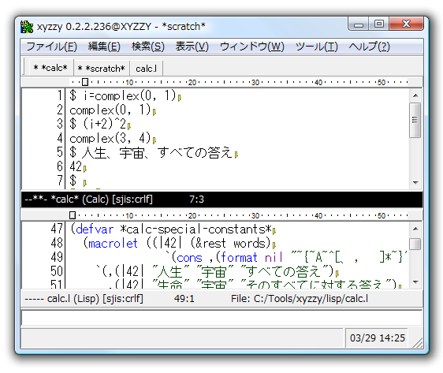



xyzzy はカスタマイズ可能で軽快な Windows 用のテキストエディタのようなものです。
作者も使ったことのないような機能を満載しています。

<a href="downloads/xyzzy-0.2.2.247.zip">

0.2.2.247</a>
<a class="release-note" href="http://xyzzy-022.github.com/xyzzy/2013/01/29/xyzzy-0_2_2_247-release-note/">リリースノート</a>

xyzzy は [亀井哲弥氏](http://www.jsdlab.co.jp/~kamei/) よって開発された Emacs ライクなテキストエディタです。
Common Lisp にほぼ準拠した言語で拡張可能であり、多くの機能が Lisp によって実装されています。

他にも以下のような特徴があります。

  * 使いやすい 2 画面ファイラー
  * 複素数や「人生、宇宙、すべての答え」を計算できる [電卓]
  * COM・FFI (Foreign Function Interface; DLL 呼び出し) による他の Windows プログラムの制御
  * [Twitter クライアント]、[2ch クライアント]、五目並べなどの暇つぶしツール
  * 軽快な動作
  * その他いろいろ

  [電卓]: http://xyzzy.s53.xrea.com/wiki/index.php?Calc-mode%A4%CEManual
  [Twitter クライアント]: http://www.moongift.jp/2011/10/20111025-2/
  [2ch クライアント]: http://www7a.biglobe.ne.jp/~hat/xyzzy/2ch-mode.html

初めて利用する場合は [xyzzy Wiki の QuickTour](http://xyzzy.s53.xrea.com/wiki/index.php?QuickTour) をご覧下さい。

## License

フリーなソフトウェア改め、MIT ライセンスで公開しています。

現在は亀井氏に代わり有志により開発が継続しています。

## Links

  * [窓の杜 - xyzzy](http://www.forest.impress.co.jp/lib/offc/document/txteditor/xyzzy.html)
  * [窓の杜 - 【NEWS】「Emacs」風テキストエディター「xyzzy」が6年ぶりのアップデート](http://www.forest.impress.co.jp/docs/news/20120330_522756.html)

## Contact

  * Twitter: [@x022235](https://twitter.com/#!/x022235)
  * Mail: <x022235@gmail.com>
  * GitHub: <https://github.com/xyzzy-022/xyzzy>
